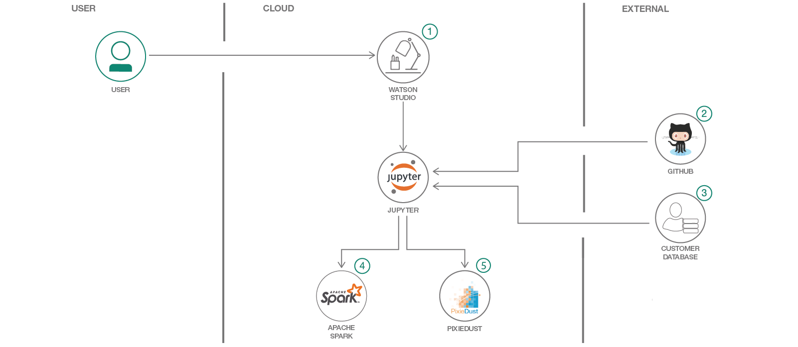
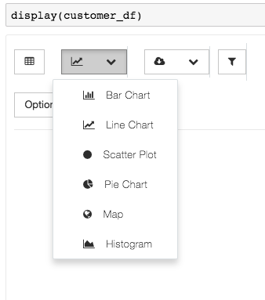
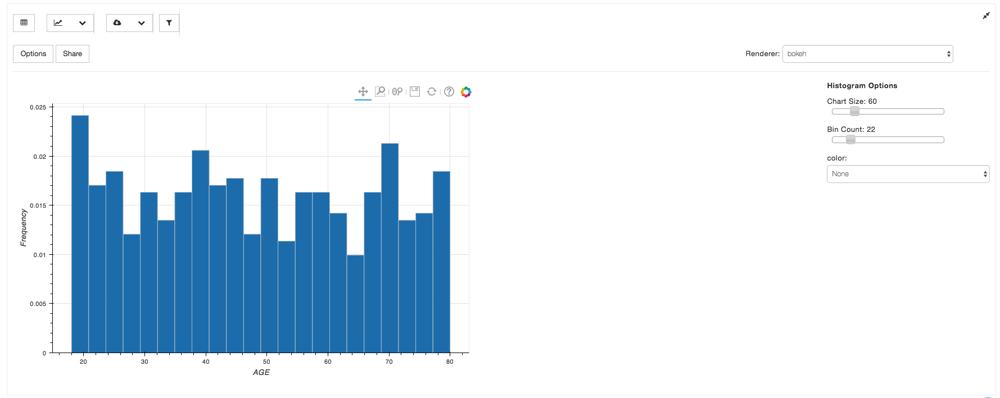

# Analyze customer data using Jupyter notebooks, Apache Spark, and PixieDust

In this code pattern historical shopping data is analyzed with Spark and PixieDust. The data is loaded, cleaned and then analyzed by creating various charts and maps.

When you have completed this code patterns, you will understand how to:

* Use [Jupyter Notebooks](http://jupyter.org/) in [IBM Watson Studio](https://dataplatform.ibm.com/)
* Load data with PixieDust and clean data with Spark
* Create charts and maps with [PixieDust](https://github.com/pixiedust/pixiedust)

The intended audience is anyone interested in quickly analyzing data in a Jupyter notebook.

## Flow

1. Log in to IBM Watson Studio
1. Load the provided notebook into Watson Studio
1. Load the customer data in the notebook
1. Transform the data with Apache Spark
1. Create charts and maps with PixieDust

## Included Components

* [IBM Watson Studio](https://console.bluemix.net/catalog/services/watson-studio): a suite of tools and a collaborative environment for data scientists, developers and domain experts
* [PixieDust](https://github.com/pixiedust/pixiedust): Open source Python package, providing support for Javascript/Node.js code.

## Steps

1. [Create a project](#1-create-a-project)
1. [Create a notebook](#2-create-the-notebook)
1. [Load customer data in the notebook](#3-load-customer-data)
1. [Transform the data with Apache Spark](#4-transform-data)
1. [Create charts and maps with PixieDust](#5-create-charts)

### 1. Create a project and add the Spark services

* Log into IBM's [Watson Studio](https://dataplatform.cloud.ibm.com). Once in, you'll land on the dashboard.

* Create a new project by clicking `+ New project` and choosing `Data Science`:

  

* Enter a name for the project name and click `Create`.

* **NOTE**: By creating a project in Watson Studio a free tier `Object Storage` service and `Watson Machine Learning` service will be created in your IBM Cloud account. Select the `Free` storage type to avoid fees.

  

* Upon a successful project creation, you are taken to a dashboard view of your project. Take note of the `Assets` and `Settings` tabs, we'll be using them to associate our project with any external assets (datasets and notebooks) and any IBM cloud services.

  

## 2. Create a notebook

* From the new project `Overview` panel, click `+ Add to project` on the top right and choose the `Notebook` asset type.

  

* Fill in the following information:

  * Select the `From URL` tab. [1]
  * Enter a `Name` for the notebook and optionally a description. [2]
  * Under `Notebook URL` provide the following url: [https://raw.githubusercontent.com/IBM/analyze-customer-data-spark-pixiedust/master/notebooks/analyze-customer-data.ipynb](https://raw.githubusercontent.com/IBM/analyze-customer-data-spark-pixiedust/master/notebooks/analyze-customer-data.ipynb) [3]
  * For `Runtime` select the `Spark Python 3.6` option. [4]

  

* Click the `Create` button.

* **TIP:** Once successfully imported, the notebook should appear in the `Notebooks` section of the `Assets` tab.

## 3. Load customer data in the notebook

* Run the cells one at a time. Select the first cell and press the `(►) Run` button to start stepping through the notebook.

* Load the data set [customers_orders1_opt.csv](data/customers_orders1_opt.csv) into the notebook.

## 4. Transform the data with Apache Spark

Before analyzing the data, it needs to be cleaned and formatted. This can be done with a few [pyspark](https://spark.apache.org/docs/latest/api/python/index.html) commands:

* Select only the columns you are interested in with `df.select()`

* Convert the AGE column to a numeric data type so you can run calculations on customer age with a user defined function ([udf](https://spark.apache.org/docs/latest/api/python/pyspark.sql.html?highlight=udf#pyspark.sql.functions.udf)).

* Derive the gender information for each customer based on the salutation and rename the GenderCode column to GENDER with a second `udf`.

## 5. Create charts and maps with PixieDust

The data can now be explored with PixieDust:

* With `display()` explore the data in a table.

* Then click on the below button to create one of the charts in the list.

* Drag and drop the variables you want to display into the `Keys` and `Values` fields. Select the aggregation from the drop-down menu and click `OK`.

* From the menu on the right of the chart you can select which renderer you want to use, where each one of them visualises the data in a different way. Other options are clustering by a variable, the size and orientation of the chart and the display of a legend.

* Below are two examples of a bar chart and a map created in the notebook.

> Histogram
> 

> Map
> 

## Related links

* [Build a recommender with Apache Spark and Elasticsearch](https://developer.ibm.com/code/patterns/build-a-recommender-with-apache-spark-and-elasticsearch/)
* [Create a web-based mobile health app using Watson services on IBM Cloud and IBM Watson Studio](https://developer.ibm.com/code/patterns/develop-web-based-mobile-health-app-uses-machine-learning/)
* [Use machine learning to predict U.S. opioid prescribers with Watson Studio and scikit-learn](https://developer.ibm.com/code/patterns/analyze-open-medical-data-sets-to-gain-insights/)

## Learn more

* **Watson Studio**: Master the art of data science with IBM's [Watson Studio](https://datascience.ibm.com/)
* **Data Analytics Code Patterns**: Enjoyed this Code Pattern? Check out our other [Data Analytics Code Patterns](https://developer.ibm.com/code/technologies/data-science/)

## License

This code pattern is licensed under the Apache Software License, Version 2.  Separate third party code objects invoked within this code pattern are licensed by their respective providers pursuant to their own separate licenses. Contributions are subject to the [Developer Certificate of Origin, Version 1.1 (DCO)](https://developercertificate.org/) and the [Apache Software License, Version 2](http://www.apache.org/licenses/LICENSE-2.0.txt).

[Apache Software License (ASL) FAQ](http://www.apache.org/foundation/license-faq.html#WhatDoesItMEAN)
