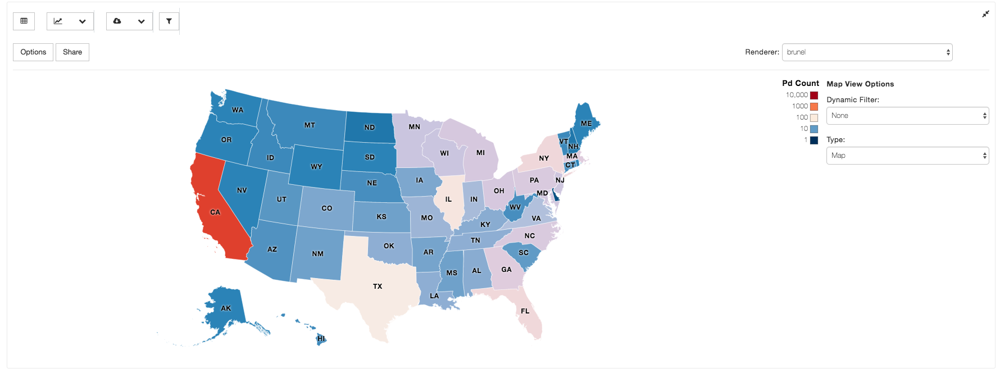

# Analyze customer data using Jupyter notebooks, Apache Spark, and PixieDust

In this code pattern historical shopping data is analyzed with Spark and PixieDust. The data is loaded, cleaned and then analyzed by creating various charts and maps. 

When you have completed this code patterns, you will understand how to:

* Use [Jupyter Notebooks](http://jupyter.org/) in [IBM Watson Studio](https://dataplatform.ibm.com/)
* Load data with PixieDust and clean data with Spark
* Create charts and maps with [PixieDust](https://github.com/pixiedust/pixiedust)

The intended audience is anyone interested in quickly analyzing data in a Jupyter notebook.

## Flow

1. Log in to IBM Watson Studio
1. Load the provided notebook into Watson Studio
1. Load the customer data in the notebook
1. Transform the data with Apache Spark
1. Create charts and maps with PixieDust

## Included Components
* [IBM Watson Studio](https://console.bluemix.net/catalog/services/watson-studio): a suite of tools and a collaborative environment for data scientists, developers and domain experts
* [IBM Apache Spark](https://console.ng.bluemix.net/catalog/services/apache-spark): an open source cluster computing framework optimized for extremely fast and large scale data processing

## Featured Technologies
* [Jupyter notebooks](http://jupyter.org/): an open-source web application that allows you to create and share documents that contain live code, equations, visualizations and explanatory text
* [PixieDust](https://github.com/pixiedust/pixiedust): Open source Python package, providing support for Javascript/Node.js code.

# Steps

1. [Sign up for Watson Studio](#1-sign-up-for-watson-studio)
1. [Create a project](#2-create-a-project)
1. [Create a notebook](#3-create-the-notebook)
1. [Load customer data in the notebook](#4-load-customer-data)
1. [Transform the data with Apache Spark](#5-transform-data)
1. [Create charts and maps with PixieDust](#6-create-charts)

## 1. Sign up for Watson Studio

Sign up for [IBM Watson Studio](https://dataplatform.ibm.com). By creating a project in Watson Studio a free tier ``Object Storage`` service will be created in your IBM Cloud account.

## 2. Create a project and add the Spark services

* Create a new project by clicking on the tile as below. Choose `Complete` and click `OK`. 
 

 
* Give your Project a name.
* Select an Object Storage from the drop-down menu or create a new one for free. This is used to store the notebooks and data. Do not forget to click refresh when returning to the Project page.
* click `Create`.  
 
* Associate the project with an Apache Spark service instance. Go to the `Settings` tab at the top of the Project page, and then scroll down to Associated Services. Click + and select Spark from the drop-down menu. Select an existing service or create a new one for free.
 

## 3. Create a notebook

* Add a new notebook. Go to the `Assets` tab at the top of the Project page. Scroll down to `Notebooks` and click +. Choose new notebook `From URL`. Give your notebook a name and copy this URL: 
https://raw.githubusercontent.com/IBM/analyze-customer-data-spark-pixiedust/master/notebooks/analyze-customer-data.ipynb
* Make sure you select Spark as your runtime and click `Create Notebook`.
 

 
* The notebook will load. 
 
## 4. Load customer data in the notebook

* Run the cells one at a time. Select the cell, and then press the `Play` button in the toolbar.
* Make sure the latest version of PixieDust is installed. If you get a warning run this code in a new cell: `pip install --user --upgrade pixiedust`.
* Load the data into the notebook.

## 5. Transform the data with Apache Spark

Before analyzing the data, it needs to be cleaned and formatted. This can be done with a few [pyspark](https://spark.apache.org/docs/latest/api/python/index.html) commands:

* Select only the columns you are interested in with `df.select()`
* Convert the AGE column to a numeric data type so you can run calculations on customer age with a user defined function ([udf](https://spark.apache.org/docs/latest/api/python/pyspark.sql.html?highlight=udf#pyspark.sql.functions.udf)).
* Derive the gender information for each customer based on the salutation and rename the GenderCode column to GENDER with a second `udf`.

## 6. Create charts and maps with PixieDust

The data can now be explored with PixieDust:

* With `display()` explore the data in a table.

* Then click on the below button to create one of the charts in the list.

* Drag and drop the variables you want to display into the `Keys` and `Values` fields. Select the aggregation from the drop-down menu and click `OK`.

* From the menu on the right of the chart you can select which renderer you want to use, where each one of them visualises the data in a different way. Other options are clustering by a variable, the size and orientation of the chart and the display of a legend. 

* Below are two examples of a bar chart and a map created in the notebook.

# Related links
[Build a recommender with Apache Spark and Elasticsearch](https://developer.ibm.com/code/patterns/build-a-recommender-with-apache-spark-and-elasticsearch/)

[Create a web-based mobile health app using Watson services on IBM Cloud and IBM Watson Studio](https://developer.ibm.com/code/patterns/develop-web-based-mobile-health-app-uses-machine-learning/)

[Use machine learning to predict U.S. opioid prescribers with Watson Studio and scikit-learn](https://developer.ibm.com/code/patterns/analyze-open-medical-data-sets-to-gain-insights/)

# Learn more
* **Watson Studio**: Master the art of data science with IBM's [Watson Studio](https://datascience.ibm.com/)
* **Data Analytics Code Patterns**: Enjoyed this Code Pattern? Check out our other [Data Analytics Code Patterns](https://developer.ibm.com/code/technologies/data-science/)
* **With Watson**: Want to take your Watson app to the next level? Looking to utilize Watson Brand assets? [Join the With Watson program](https://www.ibm.com/watson/with-watson/) to leverage exclusive brand, marketing, and tech resources to amplify and accelerate your Watson embedded commercial solution.

# License

This code pattern is licensed under the Apache Software License, Version 2. Separate third party code objects invoked within this code pattern are licensed by their respective providers pursuant to their own separate licenses. Contributions are subject to the Developer [Certificate of Origin, Version 1.1 (“DCO”)] (https://developercertificate.org/) and the [Apache Software License, Version 2]( (http://www.apache.org/licenses/LICENSE-2.0.txt).

ASL FAQ link: http://www.apache.org/foundation/license-faq.html#WhatDoesItMEAN